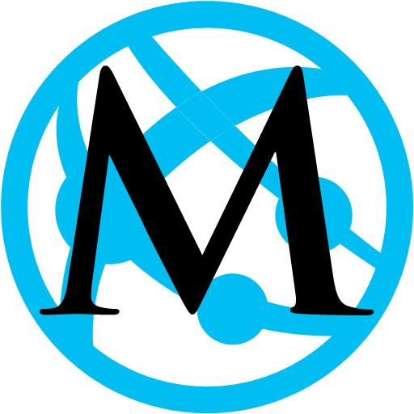
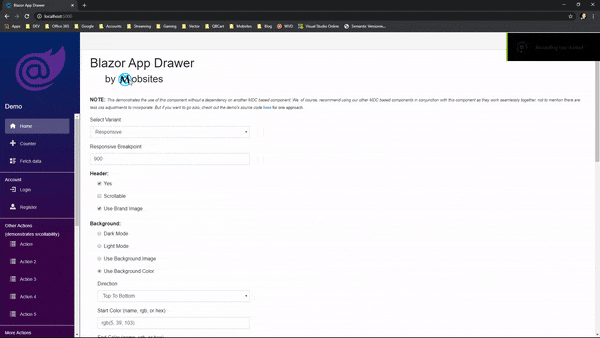

[](https://dev.azure.com/Mobsites-US/Blazor%20App%20Drawer/_build/latest?definitionId=10&branchName=master)


# Blazor App Drawer
by <a href="https://www.mobsites.com">obsites</a>

A Blazor component that utilizes the [MDC Drawer](https://material.io/develop/web/components/drawers/) library to organize access to destinations and other functionality in a Blazor app.


## [Demo](https://www.mobsites.com/Blazor.AppDrawer/)
Tap the link above to go to a live demo. Try some of the options to get an idea of what's possible. Then reload the app in the browser and watch how the state was kept! 

Check out its source code [here](./demo).



## For
* Blazor WebAssembly
* Blazor Server

## Dependencies

###### .NETStandard 2.0
* Microsoft.AspNetCore.Components (>= 3.1.2)
* Microsoft.AspNetCore.Components.Web (>= 3.1.2)

## Design and Development
The design and development of this Blazor component was heavily guided by Microsoft's [Steve Sanderson](https://blog.stevensanderson.com/). He outlines a superb approach to building and deploying a reusable component library in this [presentation](https://youtu.be/QnBYmTpugz0) and [example](https://github.com/SteveSandersonMS/presentation-2020-01-NdcBlazorComponentLibraries).

As for the non-C# implementation of this library, obviously Google's MDC Navigation Drawer [docs](https://material.io/develop/web/components/drawers/) were consulted.

After much thought, the full implementation of Google's MDC Navigation Drawer was (for now) decided against in favor of a mobile-first approach. As a result, the dismissible and permanent variants were left out, and only the modal variant and a hybrid variant called responsive made it in. (The responsive being the modal and permanent variants combined, transition occurring on a responsive media breakpoint.)

Also, unlike some of the other MDC drawer components out there for Blazor, this one was designed without requiring the user to wire up a C# onclick event handler or callback function for toggling of the drawer in modal mode. I wanted the implementation to be as close to pure html tags and css as possible.

At the end of the day, a C# onclick event handler or callback function must interop with javascript to get the desired toggling effect and, thus, seemed like an unnecessary burden on the user when the same effect could be achieved via predefined css classes.

The component, therefore, works seamlessly with `Blazor TopAppBar` *without the user having to take any special steps*. In the case of using a custom app bar, as the demo demonstrate, simply applying a couple of css classes is all that is necessary.

## Getting Started
1. Add [Nuget](https://www.nuget.org/packages/Mobsites.Blazor.AppDrawer/) package:

```shell
dotnet add package Mobsites.Blazor.AppDrawer --version 1.0.0-preview3
```

2. Add the following link tag to `index.html` (WebAssembly) or `_Host.cshtml` (Server) just above the closing `</head>` tag, along with your other link tags:

```html
<link href="_content/Mobsites.Blazor.AppDrawer/bundle.css" rel="stylesheet" />
```

3. Add the following script tag to `index.html` (WebAssembly) or `_Host.cshtml` (Server) just above the closing `</body>` tag, along with your other script tags:

```html
<script src="_content/Mobsites.Blazor.AppDrawer/bundle.js"></script>
```

4. Add the following using statement to the `_Imports.razor` file:

```html
@using Mobsites.Blazor
```

5. Add the following markup to the `MainLayout.razor` file:

```html
<!-- Add optional app bar here or below inside <AppContent> tag -->
<AppDrawer>
    <!-- Add optional header here. Keep outside of <AppDrawerContent> tag to avoid scrolling -->
    <!-- Required -->
    <AppDrawerContent>
        <!-- Add navigation content or app functionality here -->
    </AppDrawerContent>
</AppDrawer>
<AppContent>
    <!-- Add optional app bar here or above at top -->
    <!-- Add main content here -->
</AppContent>
```

6. While adding an app bar is optional, being able to toggle the drawer when in a modal state is a must, so employ a button using `AppDrawer.AppDrawerButtonMarker` for the id or as a class marker at the very least if going barless:

```html
<button id="@AppDrawer.AppDrawerButtonMarker" class="navbar-toggler no-outline mr-auto">
    <span class="oi oi-menu align-middle"></span>
</button>
```

7. Add header (optional):

```html
<AppDrawerHeader 
            Image="blazor.png"
            UseImage 
            Title="Demo" />
```

## App Drawer Attributes
Below highlights some of the built-in C# attributes and their defaults (if any). Use intellisense to get more details and learn about others:
```html
<AppDrawer
    KeepState="false"
    ModalOnly="false"
    ResponsiveBreakpoint="900"
    Color="null"
    BackgroundMode="BackgroundModes.None"
    BackgroundColor="null"
    BackgroundColorDirection="BackgroundColorDirections.BottomToTop"
    BackgroundColorStart="null"
    BackgroundColorEnd="null"
    BackgroundImage="null">
</AppDrawer>
```


## Responsive Mode Breakpoint
The `<AppDrawer>` tag has an attribute of the name `ResponsiveBreakpoint` that accepts an integer value. The default is 900 (in pixels). Changing this value affects when (and if) the component transitions between a modal and fixed state.

## Keeping State
Keeping state is as simple as setting the `KeepState` attribute to true. This component will keep relevant state in the browser's storage. To get a sense of this, check out the [demo](https://www.mobsites.com/Blazor.AppDrawer/), change some options, and refresh the browser to force a reload of the app. 

## Possible CSS Rule Conflicts

You may find that your current styles conflict with this library's css rules. Some of these rules are necessary for the responsive mode to work properly. Modal drawers are elevated above most of the app’s UI and generally don’t affect the screen’s layout grid, so you should be able to get by if changing any of these defaults when using the modal only mode.

You can see all of this library's styles [here](./src/app.scss).
